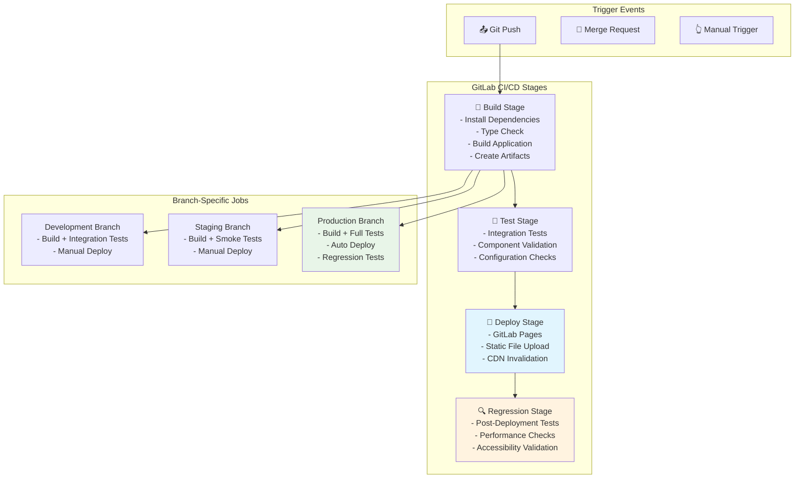
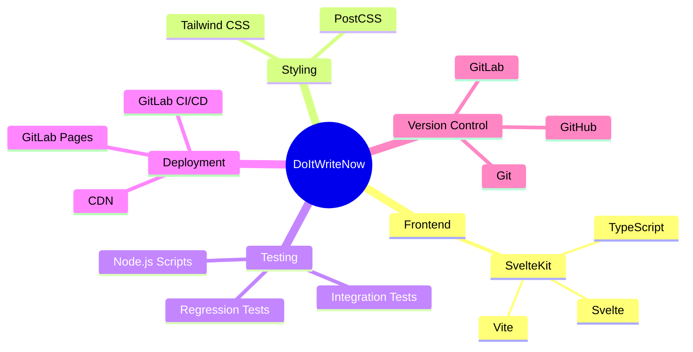
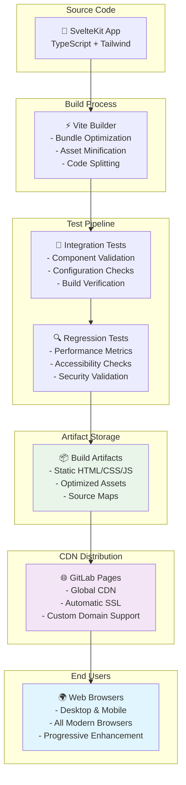
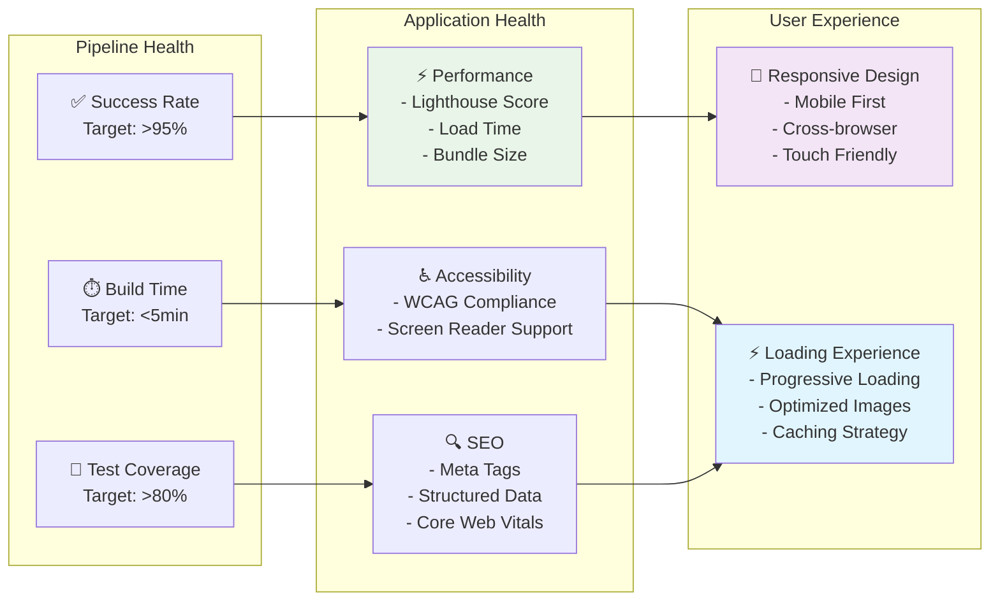
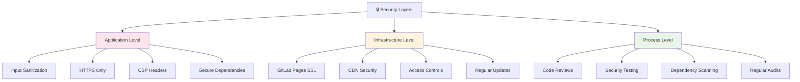
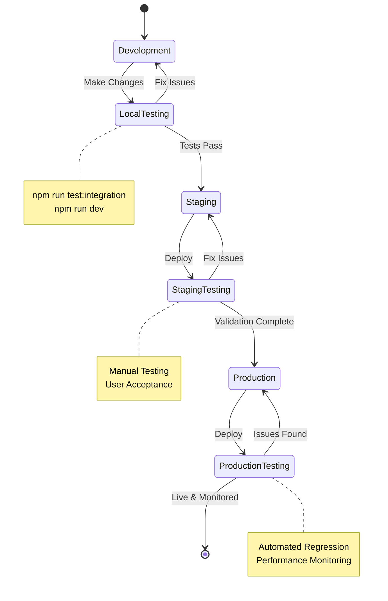
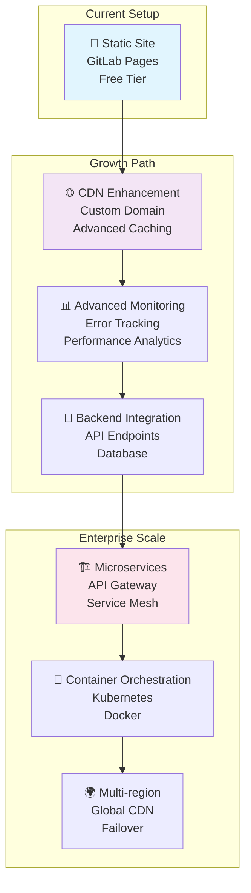

# System Architecture & CI/CD Pipeline

## 🏗️ Overall Architecture

```mermaid
graph TB
    subgraph "Development Environment"
        DEV[👨‍💻 Developer Workstation]
        LOCAL[📁 Local Repository<br/>- development branch]
        TESTS[🧪 Local Tests<br/>- Integration Tests<br/>- Regression Tests]
    end

    subgraph "Version Control"
        GITHUB[🐙 GitHub Repository<br/>- production (default)<br/>- staging<br/>- development]
    end

    subgraph "CI/CD Platform"
        GITLAB[🐧 GitLab CI/CD<br/>- Automated Pipelines<br/>- Build & Test Jobs]
    end

    subgraph "Deployment Targets"
        PAGES[📄 GitLab Pages<br/>- Static Hosting<br/>- Automatic SSL<br/>- CDN Distribution]
    end

    subgraph "Production Environment"
        PROD[🌐 Live Website<br/>https://username.gitlab.io/doitwritenow<br/>- Svelte SPA<br/>- Responsive Design<br/>- SEO Optimized]
    end

    DEV --> LOCAL
    LOCAL --> TESTS
    TESTS --> GITHUB
    GITHUB --> GITLAB
    GITLAB --> PAGES
    PAGES --> PROD

    style PROD fill:#e1f5fe
    style PAGES fill:#f3e5f5
    style GITLAB fill:#e8f5e8
    style GITHUB fill:#fff3e0
    style LOCAL fill:#fce4ec
```

## 🔄 CI/CD Pipeline Flow



## 🌿 Git Branch Strategy

```mermaid
gitgraph
    commit id: "Initial commit"
    branch development
    checkout development
    commit id: "Add CI/CD pipeline"
    commit id: "Setup test scripts"
    commit id: "Update documentation"

    branch staging
    checkout staging
    merge development

    branch production
    checkout production
    merge staging

    checkout development
    commit id: "New feature development"
    commit id: "Fix integration tests"

    checkout staging
    merge development
    commit id: "Staging validation"

    checkout production
    merge staging
    commit id: "Production deployment"
```

## 📁 Project Structure

```
doitwritenow/
├── 📁 src/                          # Source code
│   ├── 📁 lib/
│   │   ├── 📁 components/           # Svelte components
│   │   │   ├── Accordion.svelte
│   │   │   ├── Box.svelte
│   │   │   ├── Header.svelte
│   │   │   ├── Footer.svelte
│   │   │   └── WhatsappWidget.svelte
│   │   └── 📁 images/
│   │       └── WhatsappLogo.svelte
│   ├── 📁 routes/                   # SvelteKit routes
│   │   ├── +page.svelte            # Home page
│   │   ├── 📁 contact-us/
│   │   ├── 📁 services/
│   │   └── 📁 testimonials/
│   ├── app.html                     # HTML template
│   ├── app.css                      # Global styles
│   └── app.d.ts                     # TypeScript declarations
├── 📁 scripts/                      # Test scripts
│   ├── run-integration-tests.js     # Development tests
│   └── run-regression-tests.js      # Production tests
├── 📁 static/                       # Static assets
│   └── favicon.png
├── 📁 docs/                         # Documentation
│   ├── CI-CD-GUIDE.md              # Pipeline guide
│   └── DEPLOYMENT-CONFIG.md        # Deployment config
├── .gitlab-ci.yml                   # GitLab CI/CD config
├── package.json                     # Dependencies & scripts
├── svelte.config.js                 # SvelteKit config
├── tailwind.config.js               # Tailwind CSS config
├── tsconfig.json                    # TypeScript config
└── vite.config.ts                   # Vite build config
```

## 🔧 Technology Stack



## 🚀 Deployment Architecture



## 📊 Pipeline Metrics & Monitoring



## 🔐 Security & Compliance



## 🎯 Development Workflow



## 📈 Scaling Considerations



---

## 📋 Quick Reference

### 🚀 Deploy Commands
```bash
# Local development
npm run dev

# Local testing
npm run test:integration
npm run regression

# Git workflow
git checkout development  # Work here
git push origin development  # Triggers CI/CD
```

### 🔗 Important URLs
- **Repository**: `https://github.com/anzaeee/doitwritenow`
- **Production**: `https://username.gitlab.io/doitwritenow`
- **CI/CD**: `https://gitlab.com/username/doitwritenow/-/pipelines`

### 📊 Pipeline Stages
1. **Build** → Compile & bundle
2. **Test** → Integration tests
3. **Deploy** → GitLab Pages
4. **Regression** → Post-deploy validation

### 🎯 Branch Purposes
- **`development`** → Active development
- **`staging`** → Pre-production testing
- **`production`** → Live website

---

*This architecture supports the current static site deployment while providing a clear path for future scaling and feature additions.*
